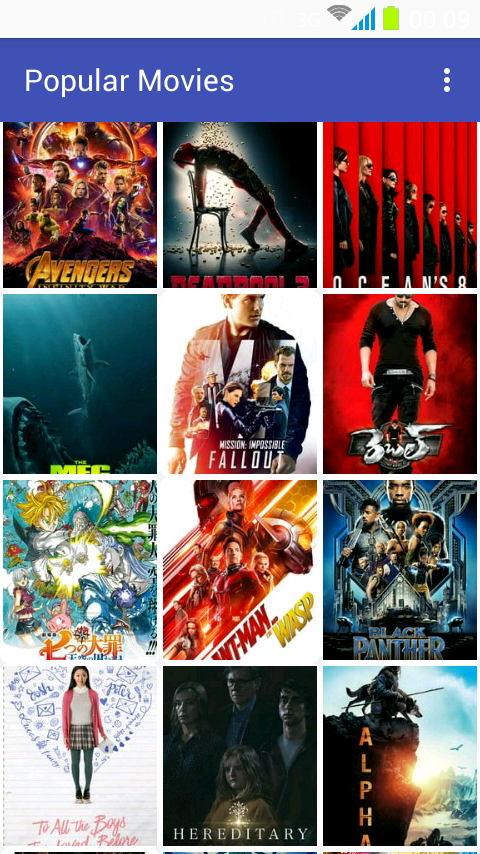
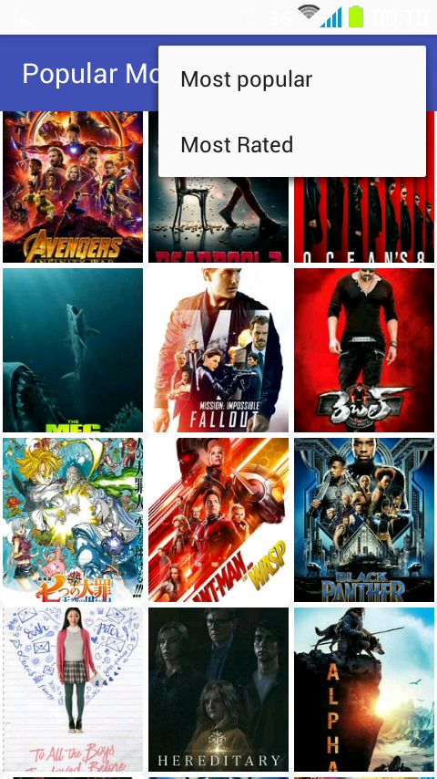
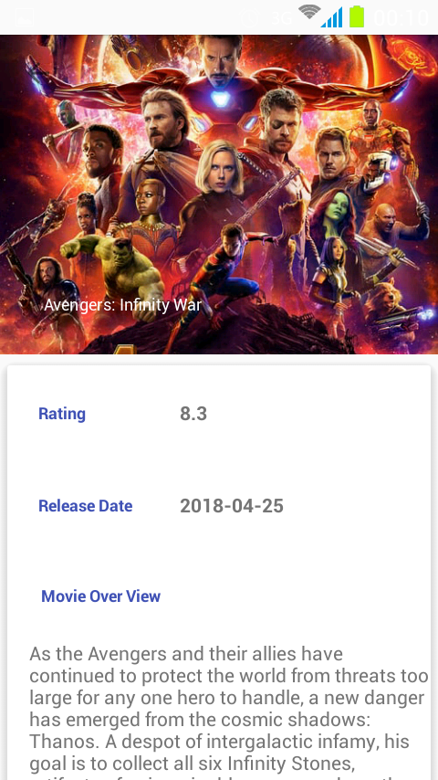
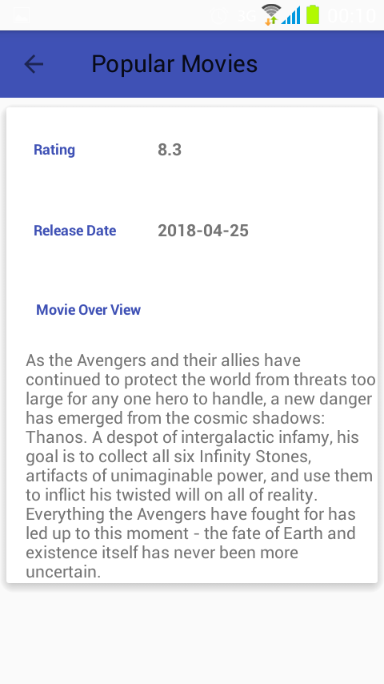

# This is stage 1 of the popular movies Application of  the Udacity nano degree program.
## Functionalities (The application is in java programming language).
```
- The application presents a user with a grid arrangement of the movies.
- The User can sort the movies using dropdown options menu to sort either by most popular or most rated.
- Upon selecting a user is taken to the details page of the specific movie.
```
## Tools Used for development
```
- Android Studio
- Volley library
- RecyclerView
- Cardview
- Glide image loading library
```
## Screen shots
<br/>
<br/>
<br/>

